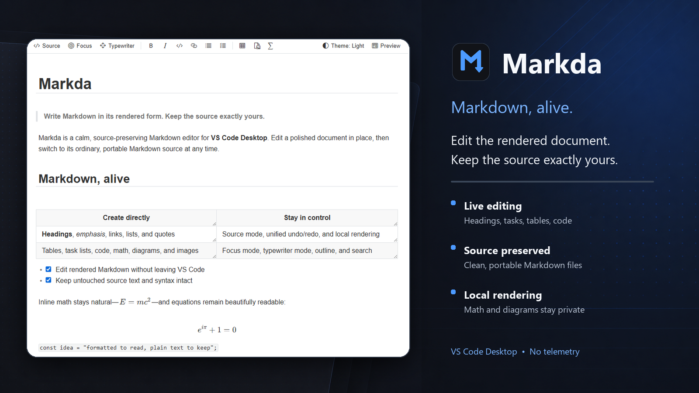
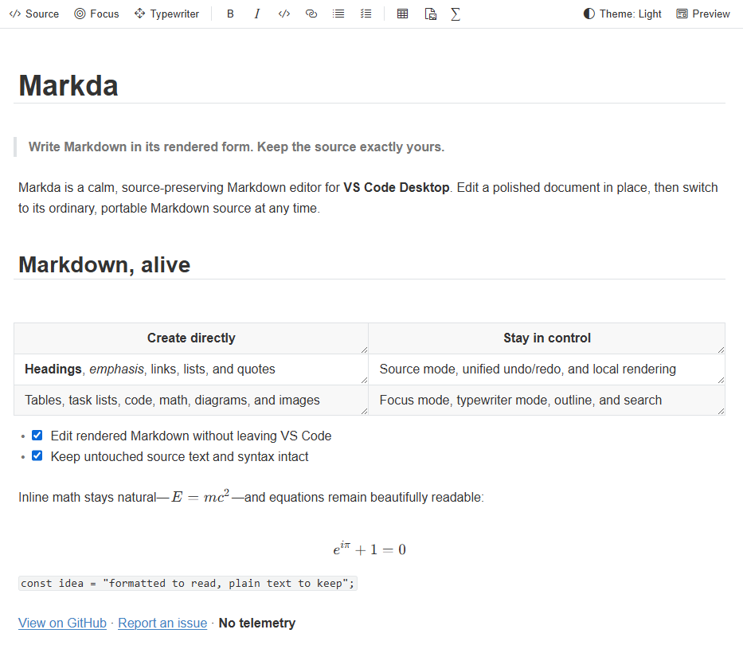

# Markda



**Edit the document you see. Keep the Markdown you own.**

Markda is a source-preserving Markdown editor for VS Code Desktop. Write directly in the rendered document—headings, tasks, tables, code, math, diagrams, and images included—while the file on disk remains clean, portable Markdown.

> Markda 0.1 is a preview release. Keep important work under version control and report reproducible editing issues.

[Report a bug](https://github.com/tetsuji16/Markda/issues) · [Release history](https://github.com/tetsuji16/Markda/blob/main/CHANGELOG.md) · [Sponsor Markda](https://github.com/sponsors/tetsuji16)

## Source-preserving by design



The VS Code text document remains the single source of truth. Markda applies focused edits to that document while preserving untouched content and Markdown syntax. Switch to full source whenever you want to inspect or change it directly.

## Highlights

- Edit supported CommonMark and Markda extension syntax in place—including reference links and images, footnotes, indented code, entities, emoji shortcodes, YAML Front Matter, `[toc]`, and explicitly permitted HTML—or switch to the full source view.
- Use document-style paragraph breaks, smart HTML-to-Markdown paste, and modifier-click link opening.
- Work with tables using direct cell editing, row and column controls, drag reordering, resizing, alignment, and Tab navigation.
- Edit syntax-highlighted code blocks directly without opening source mode, with unified undo and redo behavior.
- Render KaTeX math, numbered labeled equations and references, and Mermaid diagrams without sending document content to an online rendering service.
- Insert multiple images, or save images from the clipboard and drag-and-drop into a configurable asset folder.
- Navigate with filterable Outline and Files views, workspace Markdown search, and Quick Open.
- Use focus and typewriter modes, light and dark themes, find, and document statistics.
- Export styled or bare HTML, create PDF through an installed Chromium-family browser, or invoke trusted external export targets such as Pandoc.
- Follow same-document and cross-document heading links, and show VS Code diagnostics from spell checkers, markdownlint, Vale, and other language tools in the live editor.
- Keep split editors synchronized through the underlying VS Code text document.
- Keep the selected editor theme synchronized across open Markdown tabs.
- Stay responsive in long documents with optimized statistics, outline tracking, and live-view cursor updates.
- Format from a responsive toolbar, selection controls, link dialog, or `/`
  quick insert without leaving the rendered document.
- See save synchronization, current section, document statistics, and
  actionable diagnostics in the editor status bar.

## Getting started

1. Open a Markdown file. Markda is registered for `.md`, `.markdown`, `.mdown`, `.mkd`, `.mkdn`, `.mdwn`, and `.txt` files.
2. If another editor is active, run **Markda: Open with Markda** or choose **Reopen Editor With… → Markda** from the editor tab menu.
3. Use the `</>` button or **Markda: Toggle Source Code Mode** to move between the live editor and Markdown source.
4. To return to VS Code's built-in editor, use the **Reopen with Another Editor** button in the Markda editor title.

The Markda activity-bar view provides document outline and Markdown file navigation.

## Useful commands and shortcuts

Markda's contributed shortcuts are disabled by default so they do not override
VS Code keybindings. Enable **Markda › Editor: Enable Default Keybindings** to
use the bindings below, switch the shortcut priority from the Markda editor
toolbar, or assign individual `Markda:` commands in **Keyboard Shortcuts**.

| Action | Windows/Linux | macOS |
| --- | --- | --- |
| Toggle source mode | `Ctrl+/` | `Cmd+/` |
| Toggle focus mode | `F8` | `F8` |
| Toggle typewriter mode | `F9` | `F9` |
| Bold | `Ctrl+B` | `Cmd+B` |
| Italic | `Ctrl+I` | `Cmd+I` |
| Insert link | `Ctrl+K` | `Cmd+K` |
| Numbered list | `Ctrl+Shift+[` | `Cmd+Option+O` |
| Bulleted list | `Ctrl+Shift+]` | `Cmd+Option+U` |
| Block quote | `Ctrl+Shift+Q` | `Cmd+Option+Q` |
| Code block | `Ctrl+Shift+K` | `Cmd+Option+C` |
| Strikethrough | `Alt+Shift+5` | `Ctrl+Shift+Backtick` |
| Copy as Markdown | `Ctrl+Shift+C` | `Cmd+Shift+C` |
| Paste as plain text | `Ctrl+Shift+V` | `Cmd+Shift+V` |

Search for `Markda:` in the Command Palette to see all available commands, including table and math insertion, workspace search, statistics, HTML/PDF export, and configured external export targets.

Run **Markda: Configure File Associations** to choose which of `.md`, `.markdown`, `.mdown`, `.mkd`, `.mkdn`, `.mdwn`, and `.txt` open with Markda by default. Associations can be saved for the current user or only the current workspace. They are stored in VS Code's `workbench.editorAssociations` setting, so they can also be reviewed or changed later in Settings.

## Settings

Settings under `markda.*` control editor width, delimiter pairing, typewriter behavior, split-preview delay, the live-table size limit, Markdown features, image paths, themes, export behavior, remote resources, and unsafe HTML. `markda.export.pdfBrowserPath` selects a custom Edge/Chrome/Chromium binary, while `markda.export.targets` registers trusted argument-array commands using `${source}`, `${destination}`, `${documentDir}`, `${documentName}`, and `${workspaceFolder}`. Open **Settings** and search for `markda` to see descriptions and defaults.

By default, remote resources require confirmation and unsafe HTML is disabled. In an untrusted workspace, workspace-controlled image destinations and security overrides are restricted.

## Requirements and scope

- VS Code Desktop 1.100 or later
- Local or remote desktop extension hosts; this release is not a web extension for `vscode.dev`
- HTML and PDF export are supported. Other formats can be configured as external export targets; their conversion tools are not bundled.

## Privacy and security

Markda does not include telemetry. Markdown rendering and bundled diagram and math support run locally. Opening external links or loading remote resources remains subject to Markda's security settings and VS Code Workspace Trust.

## Development

```text
npm install
npm run check
npm test
npm run build
```

Press `F5` in VS Code to open the Extension Development Host with `docs/DEMO.md`. See `docs/SPECIFICATION.md` for the compatibility contract and implementation status, and `docs/PUBLISHING.md` for the release checklist.

Bug reports and focused feature requests are welcome in [GitHub Issues](https://github.com/tetsuji16/Markda/issues).

## License

MIT
