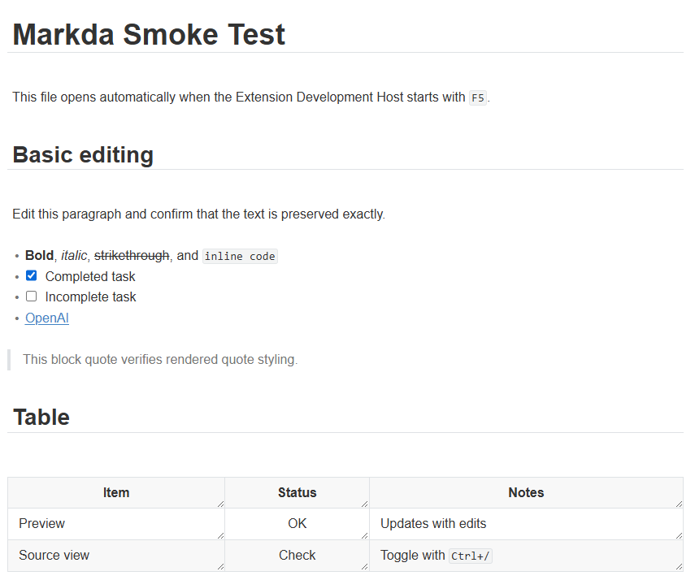
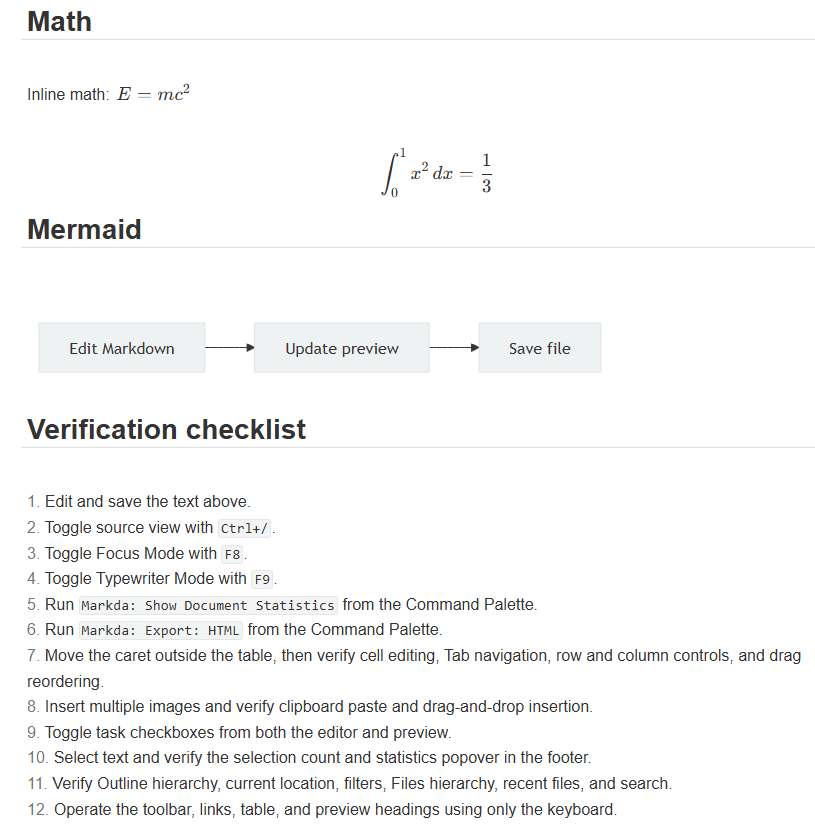

# Markda

Write Markdown. See the result. Keep the source.

Markda is a calm, source-preserving Markdown editor for VS Code Desktop. Write directly in a formatted document with headings, tasks, links, code, tables, math, diagrams, and images—while the file on disk remains ordinary Markdown.

> Markda 0.1 is a preview release. Keep important work under version control and report reproducible editing issues.

[Report a bug](https://github.com/tetsuji16/Markda/issues) · [Release history](https://github.com/tetsuji16/Markda/blob/main/CHANGELOG.md) · [Sponsor Markda](https://github.com/sponsors/tetsuji16)

## Edit the rendered document



Write and format text, update task lists, and edit table cells directly in the live document. Switch to full Markdown source whenever you need to inspect or change the syntax.

## Render math and diagrams locally



Keep equations, Mermaid diagrams, and the surrounding instructions together in one document. Click rendered math or diagrams to edit their source in place; rendering stays local.

## Highlights

- Edit the supported CommonMark and Markda extension syntax in place—including reference links and images, footnotes, indented code, entities, and explicitly permitted HTML—or switch to the full source view.
- Use document-style paragraph breaks, smart HTML-to-Markdown paste, and modifier-click link opening.
- Work with tables using direct cell editing, row and column controls, drag reordering, resizing, alignment, and Tab navigation.
- Edit code blocks directly without opening source mode, with unified undo and redo behavior.
- Render KaTeX math and Mermaid diagrams without sending document content to an online rendering service.
- Insert multiple images, or save images from the clipboard and drag-and-drop into a configurable asset folder.
- Navigate with filterable Outline and Files views, workspace Markdown search, and Quick Open.
- Use focus and typewriter modes, light and dark themes, find, and document statistics.
- Export a styled standalone HTML document or bare HTML.
- Keep split editors synchronized through the underlying VS Code text document.
- Keep the selected editor theme synchronized across open Markdown tabs.
- Stay responsive in long documents with optimized statistics, outline tracking, and live-view cursor updates.

## Getting started

1. Open a Markdown file. Markda is registered for `.md`, `.markdown`, `.mdown`, `.mkd`, `.mkdn`, `.mdwn`, and `.txt` files.
2. If another editor is active, run **Markda: Open with Markda** or choose **Reopen Editor With… → Markda** from the editor tab menu.
3. Use the `</>` button or **Markda: Toggle Source Code Mode** to move between the live editor and Markdown source.
4. To return to VS Code's built-in editor, choose **Reopen Editor With… → Text Editor**.

The Markda activity-bar view provides document outline and Markdown file navigation.

## Useful commands and shortcuts

| Action | Windows/Linux | macOS |
| --- | --- | --- |
| Toggle source mode | `Ctrl+/` | `Cmd+/` |
| Toggle focus mode | `F8` | `F8` |
| Toggle typewriter mode | `F9` | `F9` |
| Bold | `Ctrl+B` | `Cmd+B` |
| Italic | `Ctrl+I` | `Cmd+I` |
| Insert link | `Ctrl+K` | `Cmd+K` |
| Numbered list | `Ctrl+Shift+[` | `Cmd+Option+O` |
| Bulleted list | `Ctrl+Shift+]` | `Cmd+Option+U` |
| Block quote | `Ctrl+Shift+Q` | `Cmd+Option+Q` |
| Code block | `Ctrl+Shift+K` | `Cmd+Option+C` |
| Strikethrough | `Alt+Shift+5` | `Ctrl+Shift+Backtick` |
| Copy as Markdown | `Ctrl+Shift+C` | `Cmd+Shift+C` |
| Paste as plain text | `Ctrl+Shift+V` | `Cmd+Shift+V` |

Search for `Markda:` in the Command Palette to see all available commands, including table and math insertion, workspace search, statistics, and HTML export.

## Settings

Settings under `markda.*` control editor width, delimiter pairing, typewriter behavior, split-preview delay, the live-table size limit, Markdown features, image paths, themes, export behavior, remote resources, and unsafe HTML. Open **Settings** and search for `markda` to see descriptions and defaults.

By default, remote resources require confirmation and unsafe HTML is disabled. In an untrusted workspace, workspace-controlled image destinations and security overrides are restricted.

## Requirements and scope

- VS Code Desktop 1.100 or later
- Local or remote desktop extension hosts; this release is not a web extension for `vscode.dev`
- HTML export is supported; PDF and DOCX export are not included

## Privacy and security

Markda does not include telemetry. Markdown rendering and bundled diagram and math support run locally. Opening external links or loading remote resources remains subject to Markda's security settings and VS Code Workspace Trust.

## Development

```text
npm install
npm run check
npm test
npm run build
```

Press `F5` in VS Code to open the Extension Development Host with `docs/DEMO.md`. See `docs/SPECIFICATION.md` for the compatibility contract and implementation status, and `docs/PUBLISHING.md` for the release checklist.

Bug reports and focused feature requests are welcome in [GitHub Issues](https://github.com/tetsuji16/Markda/issues).

## License

MIT
