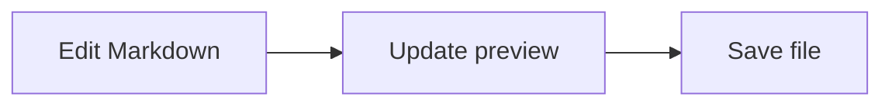

# Markda Smoke Test

This file opens automatically when the Extension Development Host starts with `F5`.

## Basic editing

Edit this paragraph and confirm that the text is preserved exactly.

- **Bold**, *italic*, ~~strikethrough~~, and `inline code`
- [x] Completed task
- [ ] Incomplete task
- [OpenAI](https://openai.com/)

> This block quote verifies rendered quote styling.

## Table

| Item | Status | Notes |
| --- | :---: | --- |
| Preview | OK | Updates with edits |
| Source view | Check | Toggle with `Ctrl+/` |

## Code

```ts
const greeting = "Hello, Markda!";
console.log(greeting);
```

## Math

Inline math: $E = mc^2$

$$
\int_0^1 x^2\,dx = \frac{1}{3}
$$

## Mermaid



## Verification checklist

1. Edit and save the text above.
2. Toggle source view with `Ctrl+/`.
3. Toggle Focus Mode with `F8`.
4. Toggle Typewriter Mode with `F9`.
5. Run `Markda: Show Document Statistics` from the Command Palette.
6. Run `Markda: Export: HTML` from the Command Palette.
7. Move the caret outside the table, then verify cell editing, Tab navigation, row and column controls, and drag reordering.
8. Insert multiple images and verify clipboard paste and drag-and-drop insertion.
9. Toggle task checkboxes from both the editor and preview.
10. Select text and verify the selection count and statistics popover in the footer.
11. Verify Outline hierarchy, current location, filters, Files hierarchy, recent files, and search.
12. Operate the toolbar, links, table, and preview headings using only the keyboard.
