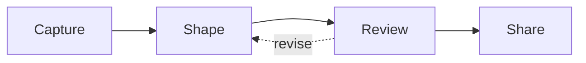

# ◇ From Idea to Impact

## The loop

1. **Capture** before the thought disappears.
2. **Shape** it into a clear story.
3. **Review** with fresh eyes.
4. **Share** when the message is ready.

> Great documents are rarely written in a straight line.
